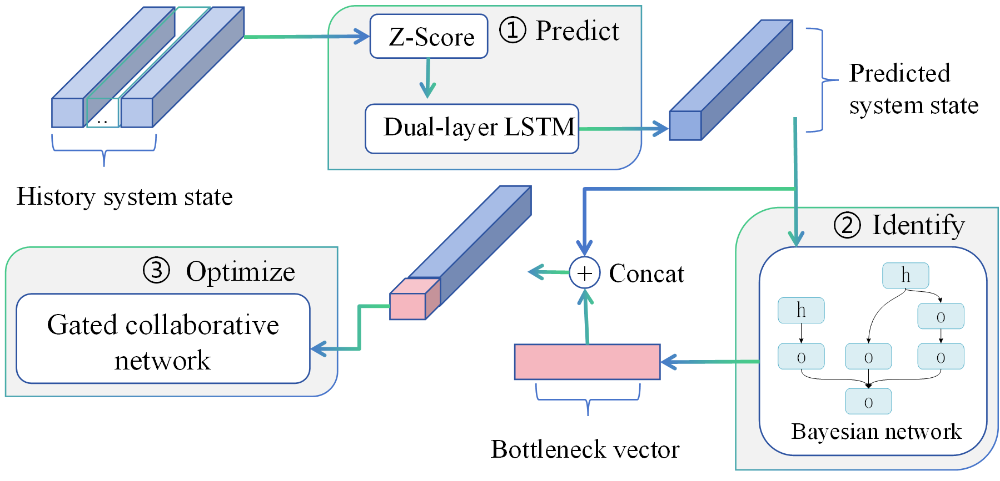

# BTune：An Adaptive Framework for OS Parameter Tuning to Mitigate Performance Bottlenecks

## Introduction
BTune is a learning-based "Predict-Identify-Tune" collaborative framework that achieves closed-loop decision-making through three hierarchical modules, as illustrated in figure. All modules are implemented in user space, as RL algorithms implemented in the OS kernel space would introduce non-trivial overhead, thereby greatly reducing performance benefits. Additionally, BTune is written in Python and modifies OS parameters through Linux sysctl interface, with good platform compatibility and scalability.



- **Performance Prediction Module**: Dynamic Multi-scale Forecasting module employs a dual-layer LSTM network with adaptive attention mechanisms to decouple long- and short-term temporal features of resource demands. It outputs predicted resource means and uncertainty confidence levels, providing risk-aware signals for optimization.
- **Bottleneck Identification Module**: Causality-Driven Bottleneck Identification module constructs a hybrid knowledge causal graph based on Bayesian networks, integrating expert-defined paths and data-driven dependency discovery. It locates root bottlenecks through dynamic causal inference.
- **Parameter Tuning Module**: Gated Collaborative Reinforcement Learning module dynamically schedules multiple experts based on prediction confidence and bottleneck vectors. It adopts hard/soft selection modes to decompose complex tasks, combines hybrid action spaces with gradient clipping strategies, and achieves safe and efficient collaborative parameter optimization.


## Environment Requirements

### Dependencies
- **Python Version**: It is recommended to use Python 3.8 or higher.
- **System**: This project is suitable for Linux systems.
- **Other Dependencies**: All the required Python libraries are listed in the `requirements.txt` file. You can install them using the following command:
```bash
pip install -r requirements.txt
```
- **A-Tune collector**: This project depends on the `collector` tool of `A-Tune`. Please ensure that it is installed before running the project.

### Install A-Tune collector
Please follow these steps to install the `collector` of `A-Tune`:

1. **Clone the a - tune repository**
```bash
git clone https://gitee.com/openeuler/A-Tune-Collector.git
```
2. **Navigate to the cloned repository directory**
```bash
cd A-Tune-Collector
```
3. **Compile and install according to the official a - tune documentation**
Please refer to the [official a - tune documentation](https://gitee.com/openeuler/A-Tune-Collector) for specific installation steps.

### Install  BTune

```bash
git clone https://github.com/anonymousano-eng/BTune.git
```

## Code Structure
The main code structure of the project is as follows:
```
BTune/
├── src/
│   ├── modules/
│   │   ├── prediction/
│   │   │   ├── lstm_model.py  # Definition of the LSTM model and data processing
│   │   │   └── __init__.py
│   │   ├── identification/
│   │   │   └── bottleneck_identification.py  # Bottleneck identification module
│   │   └── tuning/
│   │       └── rl_gate.py  # Reinforcement learning parameter tuning module
│   └── utils/
│       ├── config_loader.py  # Configuration file loader
│       └── sysctl_manager.py  # System parameter manager
├── configs/
│   ├── config.yaml # Define expert parameter spaces
│   ├── collect_data.json # Define a-tune collector collect system status
├── README.md
└── requirements.txt
```

## Usage

### Configuration File
BTune provides a YAML configuration template in the `config/` directory addresses kernel parameter inconsistencies across different Linux versions/distributions. Its architecture enables dynamic adaptation to kernel parameter changes.

To adapt to specific environments, users can use `sysctl -a` to identify target parameters and modify the YAML file to update parameter names/values, adjust constraint ranges.
```yaml
experts:
  expert1:
    parameters:
      param1:
        type: continuous
        min: 0
        max: 100
      param2:
        type: discrete
        options: ['option1', 'option2', 'option3']
  expert2:
    parameters:
      param3:
        type: continuous
        min: -10
        max: 10
```

### Quick Start
After completing the environment configuration and installation, you can run the project as follows:
1. **Start the a - tune collector**
Make sure the `collector` tool of `A-Tune` is started and working properly.
2. **Run the main program**
```bash
python main.py --config config.yaml
```
Here, `config.yaml` is the path to your configuration file.

## Notes
- Before running the project, ensure that the `A-Tune collector` is correctly installed and configured.
- The parameter settings in the configuration file need to be adjusted according to the actual system situation.
- Model training in the project may take a long time. Please be patient.

## Roadmap

- **Enhance User Experience:**
Design and implement a YAML config file template generator for different Linux distributions.

- **Tool Integration:**
Create compatible plugins to display real-time tuning results, system performance metrics, and customizable dashboards with interactive charts.

- **Large-Scale Scenario Testing:** 
Construct a simulation environment for multi-node clusters, high-concurrency workloads, and complex production scenarios.