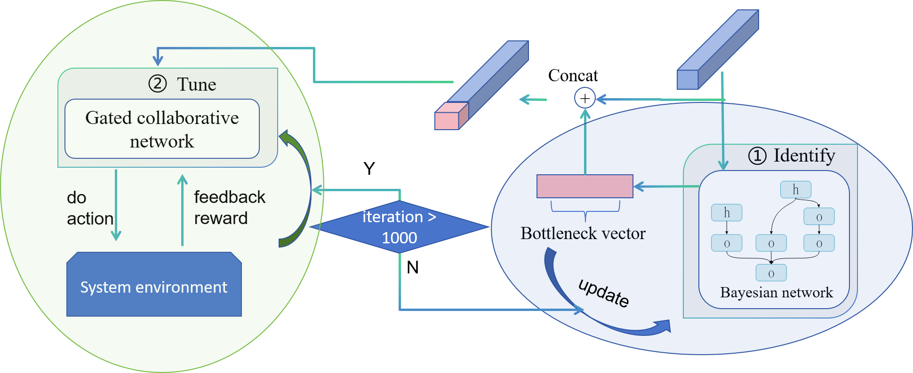

- ## BTune: Bottleneck-Centric Configuration Tuning for Universal and Efficient System Optimization

  This project is **an extension to [OPPerTune](https://github.com/microsoft/OPPerTune)**, introducing the **gated Mixture-of-Experts algorithm** as proposed in our paper. It aims to deliver efficient and interpretable automatic tuning for complex computing systems.

  ### Overview

  Modern computing systems such as databases, middleware, and web services heavily rely on parameter configuration for performance optimization. While **OPPerTune** provides RL-based automatic tuning for hybrid parameter spaces, it has limitations in dynamic/mixed workload scenarios, bottleneck identification, and interpretability.

  **This project builds upon OPPerTune with the following key innovations:**

  

  - **Bottleneck-aware tuning mechanism (Identify):** Incorporates causality-driven Bayesian bottleneck identification, partitions the parameter space by system resources (CPU, memory, I/O, network), and only tunes relevant subspaces to avoid inefficient blind search.
  - **Integration of Gated Multi-Expert Architecture (Tune):** Each parameter subspace is handled by a dedicated RL “expert,” and a gating network dynamically activates experts based on the detected bottleneck, achieving divide-and-conquer optimization and adaptive switching.
  - **Improved interpretability and generalization:** Compared to traditional single-policy or black-box models, the approach delivers faster parameter optimization, higher adaptability for mixed workloads, and transparent optimization logic.

  ### Directory Structure

  ```
  ├── src/
  │   ├── moe_ppo_tuner/          # MoE-PPO tuner algorithm
  │   └── all.py                  # Algorithm integration entry (replaces OPPerTune original)
  ├── third_party/
  │   └── OPPerTune/
  │       ├── oppertune-algorithms/
  │       │   └── src/oppertune/algorithms/
  │       └── oppertune-cores/
  ├──tests/
  |  ├──memcached_example 
  |  ├──nginx_example 
  |  ├──redis_example 
  |  ├──mongodb_example 
  |  └──mixed_example 
  ...
  ```

  ### Installation & Quick Start

  1. **Sync MoE-PPO code to OPPerTune framework**

     ```
     ./sync_oppertune.sh
     ```

  2. **Install dependencies**

     ```
     pip install -e third_party/OPPerTune/oppertune-algorithms
     pip install -e third_party/OPPerTune/oppertune-cores
     ```

  3. **Configuration and Execution**

     - See `tests/` or the paper’s experiment section for scripts supporting Nginx/Redis/MongoDB/Memcached/mixed workloads.

  ### Algorithmic Highlights

  - **Bottleneck-Aware Tuning:** Identifies system bottlenecks (e.g., CPU saturation, memory pressure) and adjusts only relevant parameters, reducing the search space.
  - **Gated MoE-PPO Architecture:** Each expert RL agent is responsible for a parameter subspace; the gating network routes decisions according to real-time bottleneck states, enabling adaptive, safe optimization.
  - **Causality-Driven Interpretability:** The tuning process is transparent, traceable, and facilitates real-world system deployment and analysis.

   to OPPerTune framework
    ```bash
    ./prepare.sh
    ```

2. **Install dependencies**
    ```bash
    pip install -e third_party/OPPerTune/oppertune-algorithms
    pip install -e third_party/OPPerTune/oppertune-cores
    ```

---

## How to Use

### 1. Prepare Your Environment

- Ensure Python 3.8+ and all dependencies are installed.
- Prepare your target workload environment (e.g., Redis, Nginx, MongoDB, Memcached, or hybrid).

### 2. Configure the Tuning Task

- Edit the provided example scripts in `tests/` or create your own task script referencing those templates.
- Specify the target workload, configuration parameter space, and performance metrics to optimize (e.g., throughput, latency).

### 3. Run Tuning with BTune Algorithm

- Start the tuning process by running a provided example or your custom script, for example:
    ```bash
    python tests/btune_nginx.py
    ```
- For other workloads, modify the corresponding script or parameter files as needed.

### 4. Monitor and Analyze Results

- During tuning, logs are saved and/or printed in real time, including per-iteration parameter suggestions and performance metrics.
- After tuning, analyze logs for best-found configurations, learning curves, and the contribution of different experts.
- Experimental data is typically saved to a CSV or log file in your working directory.


### Paper Reproducibility & Experimental Results

  All core experiments in the paper are based on the code in this repository. Main conclusions include:

  - **Single-application scenarios:** Comparable or better convergence and optimality than OPPerTune.
  - **Mixed/dynamic workloads:** Substantially outperforms OPPerTune with faster convergence, more stable optimization, and higher throughput improvement.
  - **Superior generalizability** across multi-dimensional, hybrid parameter spaces.

  For details, see the paper *BTune: Bottleneck-Centric Configuration Tuning for Universal and Efficient System Optimization*.

### Acknowledgements

  This project is based on the open-source OPPerTune framework with substantial algorithmic enhancements. Thanks to the OPPerTune authors for their foundational work.